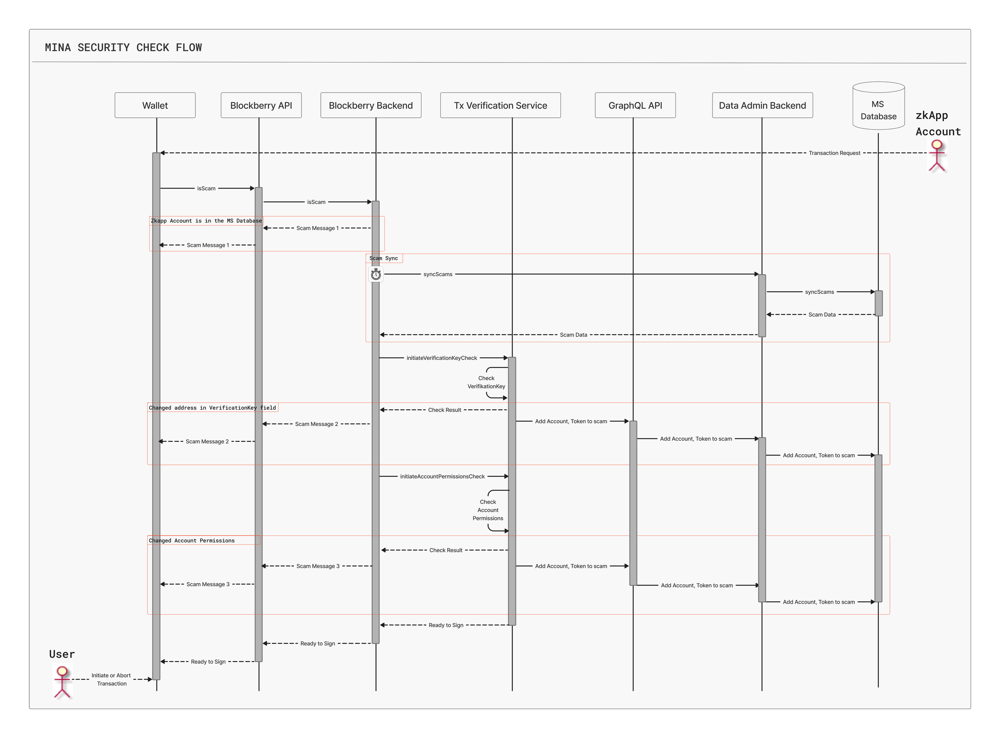

# Mina Security

1. [Project Background](#project-background)
2. [Proposal Overview](#proposal-overview)
    1. [Problem](#problem)
    2. [Solution](#solution)
    3. [Impact](#impact)
3. [Solution Details](#solution-details)
    1. [Scam Database](#scam-database)
    2. [Scam API](#scam-api)
    3. [Tx Verification Service](#tx-verification-service)
    4. [Explorer](#explorer)
    5. [Architecture](#architecture)
    6. [Tx Security Check Flow](#tx-security-check-flow)
4. [Budget and Milestones](#budget-and-milestones)
    1. [Milestones](#milestones)
        1. [Stage 1](#stage-1)
        2. [Stage 2](#stage-2)
    2. [Roadmap](#roadmap)
    3. [Budget Requested](#budget-requested)
    4. [Budget Breakdown](#budget-breakdown)
5. [Team Info](#team-info)
6. [Proposer GitHub](#proposer-github)
7. [Proposer Experience](#proposer-experience)
8. [Risks and Mitigations](#risks-and-mitigations)

## Project Background
We suggest a scam detection solution for the Mina blockchain to easily track, report, and enter scams into our open-source database that can be accessed by anyone to stay clear of scams.

We have sufficient infrastructure to develop this service that will benefit the Mina ecosystem: Minascan Explorer and Blackberry API. 

## Proposal Overview

### Problem
Scams are a serious threat to users and the blockchain ecosystem. Every year, blockchain vulnerabilities result in hundreds of thousands of users suffering from various scams: phishing attacks, routing attacks, cryptojacking, ICO schemes, scam NFTs, etc. There’s a scam list maintained by some Mina Foundation experts; however, it’s unavailable to the wider community. When a user initiates a transaction from a wallet, it’s unclear whether the contracting account is a scam account. This is a substantial scam risk.

### Solution
We create an infrastructure to detect and aggregate data about scam transactions and show scam accounts and their tokens. Our infrastructure includes a scam database, a scam API, a scam detection function built in a wallet, and an explorer. The idea is to collect all possible scam accounts and warn users who run transactions via wallets about possible scams. This will keep users vigilant and help Mina stakeholders report scams.

### Impact
Mina Security is a public good that benefits several actors: the Mina ecosystem in general, users, wallets, explorers, auditors and investigators, zkApps.

**Mina ecosystem, community, and MF Moderators**

Mina Security provides the infrastructure for collecting and accumulating scam data, which enhances the overall security of the Mina ecosystem. Mina Foundation moderators will be able to report scams to extend our database.

**Users**

We help users stay vigilant and aware of scam accounts. As a result, we prevent unnecessary fund loss and promote user trust in the Mina ecosystem.

**Wallets**

Wallets largely overlook scam detection functionality, making them vulnerable points that scam actors abuse. Some wallets, like Metamask, have started developing native scam detection, while others rely on third-party solutions. We provide a simple, ready-made solution for the wallets to process any transaction for scam. Wallets can use our data to issue scam warnings to users.

**Explorers**

Explorers can use our Blockberry scam API to fetch data about scam entities. We will integrate Mina Security with the Minascan Explorer.

**Auditors and Investigators**

Our open-source database is a credible source of scam information required by auditors and investigators who may want to check accounts for being involved in scam activities.

**ZkApps**

Whenever zkApps need scam data to develop their products or tools, they can access it via Blockberry scam API.

## Solution Details

1. Scam Database  
We maintain an open-source database where scam addresses and everything they have created are displayed. This database will be accessed via our scam API. The data will be fed from 3 sources:
- external databases provided by the Mina community;
- reports made by contributors: Mina Foundation moderators, community reviewers, and auditors;
- scam detection algorithm integrated into wallets that provides early scam alerts to users.

2. Scam API  
We provide scam API in the paid plan of Blockberry API. Endpoints about accounts (including zkApp accounts) and tokens contain scamMessage parameters that indicate scam entities. The table below lists scam parameters in Mina Blockberry API endpoints:

<table width=100%>
  <tr>
    <th>Entity</th>
    <th>Endpoint</th>
    <th>Scam Parameters</th>
  </tr>
  <tr>
    <td rowspan="4">Account</td>
    <td>getAccounts</td>
    <td>scamMessage</td>
  </tr>
  <tr>
    <td>getAccountByHash</td>
    <td>scamMessage</td>
  </tr>
  <tr>
    <td>getAccountDelegatee</td>
    <td>scamMessage</td>
  </tr>
  <tr>
    <td>getAccountTransactions</td>
    <td>senderScamMessage<br>ownerScamMessage</td>
  </tr>
  <tr>
    <td rowspan="5">Token</td>
    <td>getTokens</td>
    <td>scamMessage<br>ownerScamMessage</td>
  </tr>
  <tr>
    <td>getTokensByAddress</td>
    <td>scamMessage<br>ownerScamMessage</td>
  </tr>
  <tr>
    <td>getTokenById</td>
    <td>scamMessage<br>ownerScamMessage</td>
  </tr>
  <tr>
    <td>getHoldersByTokenId</td>
    <td>scamMessage<br>ownerScamMessage<br>holderScamMessage</td>
  </tr>
  <tr>
    <td>getTransactionsByToken</td>
    <td>scamMessage<br>tokenScamMessage<br>ownerScamMessage</td>
  </tr>
  <tr>
    <td rowspan="3">Transactions</td>
    <td>getTransactions</td>
    <td>senderScamMessage<br>tokenScamMessage</td>
  </tr>
  <tr>
    <td>getPendingTransactions</td>
    <td>senderScamMessage<br>tokenScamMessage</td>
  </tr>
  <tr>
    <td>getTransactionByHash</td>
    <td>senderScamMessage<br>tokenScamMessage</td>
  </tr>
  <tr>
    <td rowspan="5">ZkApps</td>
    <td>getZkAppTransactionsByAccountAddress</td>
    <td>senderScamMessage<br>tokenScamMessage</td>
  </tr>
  <tr>
    <td>getZkAppTransactionsbyBlockStateHash</td>
    <td>senderScamMessage<br>tokenScamMessage</td>
  </tr>
  <tr>
    <td>getZkAppTransactions</td>
    <td>senderScamMessage<br>tokenScamMessage</td>
  </tr>
  <tr>
    <td>getZkAppTransactionByTxHash</td>
    <td>senderScamMessage<br>tokenScamMessage</td>
  </tr>
  <tr>
    <td>getZkAppByAddress</td>
    <td>senderScamMessage<br>tokenScamMessage</td>
  </tr>
</table>

### 3. Tx Verification Service  
It’s critical to warn users about potential scams early on before a scam transaction runs since scam prevention is paramount. On Mina, there are indications of scam activity that we can timely track and warn of:

#### 3.1. Transactions are run by accounts stored in a scam database  

We check the pubkey bytes of the sender and all the accounts involved in the transaction to see if any of them are in the Mina Security database.

#### 3.2 Replaced Verification Key  

Every zkApp account has a verification key stored on-chain. The verification key is used to verify off-chain proofs. A sign of a scam is when the verificationKey field in the account Updates has the sender’s address in the public key. It means that a scam account enters its address hash in the verificationKey field and can take over the victim's account to drain it using this flow:

- A zkApp account requests a user to sign a transaction containing the verificationKey field.

- The zkApp account enters its address hash in the public key.

- The user doesn’t see this in the wallet application and signs the transaction.

- The scam zkApp account takes over the user's account and drains it or changes the private key, resulting in the user losing control over their funds and account.

We check this field, and if another address is entered in it, we add the account to the scam database and send a warning message to the user.

#### 3.3 Changed zkApp Account Permissions  

An account update can provide new values for certain account fields. Whether those changes are authorized is governed by a set of permissions. A permission can take on the values None, Either, Proof, Signature, Proof or Signature, or Impossible. By default, the Proof value is set. The table below lists all permissions in zkApps on Mina that govern individual field updates and sending and receiving tokens.

<table width=100%>
  <tr>
    <th>Permission</th>
    <th>Description</th>
    <th>Default Authorization</th>
  </tr>
  <tr>
    <td>edit_state</td>
    <td>The permission describing how the zkApp account's eight on-chain state fields are allowed to be manipulated.</td>
    <td>proof</td>
  </tr>
  <tr>
    <td>set_delegate</td>
    <td>The permission corresponding to the ability to set the delegate field of the account. The delegate field is the address of another account that this account is delegating its MINA for staking.</td>
    <td>signature</td>
  </tr>
  <tr>
    <td>set_permissions</td>
    <td>The permission corresponding to the ability to change the permissions of the account. As the name suggests, this type of permission describes how already set permissions can be changed.</td>
    <td>signature</td>
  </tr>
  <tr>
    <td>set_verification_key</td>
    <td>The permission corresponding to the ability to change the verification key of the account.</td>
    <td>signature</td>
  </tr>
  <tr>
    <td>set_zkapp_uri</td>
    <td>The permission corresponding to the ability to change the zkapp_uri field of the account that stores metadata about the smart contract, for example, link to the source code.</td>
    <td>signature</td>
  </tr>
  <tr>
    <td>edit_actions_state</td>
    <td>he permission that corresponds to the ability to change the actions state of the associated account. Every smart contract can dispatch actions that are committed on-chain. This type of permission describes who can change the action state.</td>
    <td>proof</td>
  </tr>
  <tr>
    <td>set_token_symbol</td>
    <td>The permission corresponding to the ability to set the token symbol for this account.</td>
    <td>signature</td>
  </tr>
  <tr>
    <td>increment_nonce</td>
    <td>The permission that determines whether to increment the nonce with an account update and who can increment the nonce on this account with a transaction.</td>
    <td>-</td>
  </tr>
  <tr>
    <td>set_voting_for</td>
    <td>The permission corresponding to the ability to set the chain hash for this account. The votingFor field is an on-chain mechanism to set the chain hash of the hard fork this account is voting for.</td>
    <td>-</td>
  </tr>
  <tr>
    <td>set_timing</td>
    <td>The permission corresponding to the ability to control the vesting schedule of time-locked accounts.</td>
    <td>-</td>
  </tr>
  <tr>
    <td>send</td>
    <td>The permission corresponding to the ability to send transactions from this account. For example, this permission determines whether someone can send a transaction to transfer MINA from this particular account.</td>
    <td>proof</td>
  </tr>
  <tr>
    <td>receive</td>
    <td>The permission determining whether a particular account can receive transactions, for example, depositing MINA.</td>
    <td>none</td>
  </tr>
  <tr>
    <td>access</td>
    <td>The permission corresponds to the ability to include any account update for this account in a transaction, even no-op account updates. Usually, the access permission is set to require no authorization.</td>
    <td>-</td>
  </tr>
</table>

A scam account can change one or several permission fields, such as the send permission from proof to signature. Now, a zk-proof is not required for such a transaction to run, and a single signature would be enough. Combining this with entering another address hash in the verification key field makes stealing the user’s funds possible.

Several signs of scams with permissions exist. We track those and assign a weight to each. When the overall weight exceeds a safe threshold, we send a scam alert to the user and add the zkApp account to our scam database.

> Our duty is to warn you of a possible scam, but it’s your own responsibility to carry on or discard a potential scam transaction. You can proceed if you like, but on this occasion, you’re fully responsible for any consequences that follow such a transaction. 

### 4. Explorer  

For each scam account and scam token, we provide a warning message that such an account and token is a scam and a message with a more extended description of the context.

This is how we show scam entities in a list.


On the figure below is a scam account.


And this is how we show a scam token.


### Architecture
Our design builds around the Scam Database, which stores scam accounts and tokens; the Blackberry Scam API, through which wallets, explorers, developers, and zkApps will access the database; and the Transaction Verification Service. 

The Scam Database integrates data from external databases using data adapters to complete ETL, our GraphQL API, and the data admin backend for data transfer. Another source of data is reports from Contributors, such as MF officials or auditors. They submit data to a Repository. Later, our Content Manager will copy those entries into our Admin Panel.

The Transaction Verification Service runs the scam check logic triggered as a transaction runs from a wallet. It receives transaction data from wallets through Blockberry API and Blockberry Backend. Then, it performs checks and sends the results back to the wallet. If the check results show that the account running the transaction is a scam account, the data about such an account and its token is sent to the Mina Security Database.

The figure below illustrates the Mina Security architecture.


### Tx Security Check Flow
Let’s take a closer look at how Mina Security will work in a real-life example. A user accesses a wallet to see a transaction request from an unknown zkApp account. Now, Mina Security has to run three checks subsequently: 

#### 1. Check if any of the accounts involved in the initiated transaction, including the sending zkApp account, are in the MS database;

#### 2. Check if another address is entered in the verificationKey field.

#### 3. Check if the accountPermissions fields have been changed.


Then, the Mina Security check flow shall look like this:

#### 1. Address Check.

1.1. The wallet queries the isScam endpoint to Blockberry API.

1.2. Blockberry API triggers its Backend to proceed with the check.

1.3. Blockberry API Backend has a copy of the MS Database that is periodically synced.

1.4.1. If any of the queried accounts are found to be in the MS Database, Blockberry API sends a scam message to the wallet to be displayed for the User.

1.4.2. If none of the queried accounts are found to be in the MS Database, Blockberry API Backend commands the Transaction Verification Service to run the Verification Key Check.

#### 2. Verification Key Check.

2.1. Transaction Verification Service runs the Verification Key Check.

2.1.1. If another address is entered in the pubKey of the Verification Key, the Transaction Verification Service sends the check result to the Blockberry API Backend.

2.1.2. Blockberry API Backend generates a scam message.

2.1.3. Blockberry API sends the message to the wallet to be displayed for the User.

2.1.4. Transaction Verification Service sends data about the scam account and its tokens to the Data Admin Backend using the GraphQL API.

2.1.5. Data Admin Backend enters the account and its tokens in the MS Database.

2.2. If the check is passed, Blockberry API commands the Transaction Verification Service to run the Account Permissions Check.

#### 3. Account Permissions Check.

 3.1. Transaction Verification Service runs the Account Permissions Check.

3.1.1. If the number of suspicious changes in the Account Permissions fields exceeds a critical threshold, the Transaction Verification Service sends the check result to the Blockberry API Backend.

3.1.2. Blockberry API Backend generates a scam message.

3.1.3. Blockberry API sends the message to the wallet to be displayed for the User.

3.1.4. Transaction Verification Service sends data about the scam account and its tokens to the Data Admin Backend using the GraphQL API.

3.1.5. Data Admin Backend enters the account and its tokens in the MS Database.

3.2.1. If the check is passed, it means that the transaction is not a scam, and the Transaction Verification Service signals to the Blockberry API Backend that the transaction is ready to sign.

3.2.2. Blockberry API generates a message that the transaction is ready to sign.

3.2.3. Blockberry API sends the message that the transaction is ready to sign to the wallet to be displayed to the User.

#### 4. Now, the User can sign the transaction and send it to the L1.

The diagram below shows how Mina Security runs transaction checks.



A scam alert doesn’t mean that the user can’t confirm and finalize the transaction; however, if the user chooses to proceed, he or she is solely responsible for the consequences.

## Budget and Milestones

### Milestones

#### Stage 1
##### Service Features
- Restore the Old Scam Database and upgrade it for compatibility with the new platform
- Create Admin Data Schema
- Create BD Data Schema
- Admin Data Sync Service
- Blockberry API + Tx Verification Service Provider
- Update Data Submit Forms (Account, Validator, Token, Scam)
##### Scam API
  - getAccounts
  - getAccountByHash
  - getAccountDelegatee
  - getAccountTransactions
  - getTransactions
  - getTransactionsbyBlockStateHash
  - getPendingTransactions
  - getTransactionByHash
##### Tx Verification Service Checks
  - Transactions are run by accounts stored in a scam database,
  - Replaced Verification Key
##### Minascan integration of SCAM API endpoints (Stage 1)
##### Mina Security Documentation (Stage 1)

#### Stage 2
##### Service Features
- Service that Records new Scam entries DB from Tx Verification Service  
##### Scam API
- getTokens
- getTokensByAddress
- getTokenById
- getHoldersByTokenId
- getTransactionsByToken
- getZkAppTransactionsByAccountAddress
- getZkAppTransactionsbyBlockStateHash
- getZkAppTransactions
- getZkAppTransactionByTxHash
- getZkAppByAddress
##### Tx Verification Service Checks
- Changed zkApp Account Permissions
##### Minascan integration of SCAM API endpoints (Stage 2)
##### Mina Security Documentation (Stage 2)

**Timeframe**
- Stage 1 - 2 months
- Stage 2 - 2 months

### Roadmap
Future functions will include:
- Integration with vendors, providers, auditors, and investigators and their databases.
- AI integration for transaction and code analysis.
- Building scam protection models based on the most typical use cases.

### Budget Requested
- Stage 1 Proposal - 30000 Mina
- Stage 2 Proposal - 30000 Mina

### Budget Breakdown
Each Stage includes these development streams:
- Building Scam Database - 5000 Mina;
- Building Scam API - 15000 Mina;
- Tx Verification Service - 5000 Mina;
- Writing code for scam checks - 5000 Mina.

### Wallet Address
```B62qm5HhL5ESWzGMBRdzjVkRGD5ZzAf8YYErcXYyDbSy7o9EXUXMqnk```

## Team Info
- Mikhail Korotkikh - smart contract developer
- Vitali Horba - project manager
- Dzmitry Sakalou - analyst
- Evgeni Haurushou - front-end developer
- Vitali Karpuk - front-end developer
- Artem Brodski - back-end developer
- Denis Streltsou - back-end developer
- Ilya Peker - analyst, designer

## Proposer GitHub
https://github.com/Staketab

## Proposer Experience
**Minascan Team:**
- Minascan;
- Minascan Custom GraphQL;
- Blockberry API platform;
- Zecoscan;
- Suiscan;
- Staketab - AA-rated Verified Staking Provider.

**Mikhail Korotkikh:**
- MinaNFT project;
- zkCloud Worker;
- Graduated from the Encode Club ZK bootcamp (October 2023);
- Graduated from the Encode Club AI foundation (December 2023).

## Risks and Mitigations
- We can’t make the project fully open-source since it can provide sensitive information (the code base) to potential scammers, who can use it to improve their methods. However, we will make scam data available to the Mina Foundation contributors.
- There’s an integration bottleneck associated with data vendors and sources being unreliable. We will shadow-copy all the data we are fed.
- Malperforming API. We will handle potential downtime issues via data backup and infrastructure scaling to ensure continuous and uninterrupted operation. The good news is that we don’t have to rely on node operation.
- zkCloudWorker can go out of service. Since the zkCloudWorker’s architecture is partly based on AWS S3, it can show stable operation, which makes it possible to avoid Lambda calls. Due to this, 99.9% uptime is assured.

In fact, most risks associated with poor uptime and bandwidth are mitigated by infrastructure improvement. Since scam detection doesn’t require 100% uptime, we can ensure the users will get 100% data coverage.
